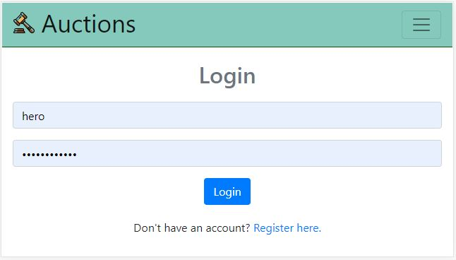

# Auctions
It is an eBay like E-Commerce auctions site (mobile responsive). It will allow users to post their auction listings, 
place bids on listings, comment on those listings, and add listings to a “watchlist.” 
The user with the highest bid on a listing will win that listing. 
(All these after creating an account and then logging in it.)

## Different Sections of this Project:

### Homepage (Active Listings)
User can see all the active listings that are available right now.

### Specific Listing
When a user clicks on any specific listing then a new page will be opened which
will contain all the information about that listing like comments, highest bid,
description, who won this listing, etc.
**Note:** A user can add a comment, bid in a listing if he/she is logged in.

### All Listings
User can see here all the listings (active or not) on this page.

### Categories
If a user wants to see listins that belongs to some specific category then the user can 
come here and check out that category's section.
**Note:** Only the active listings will be shown here of that category.

### Watchlist
User can add (or remove) a specific listing from his/her watchlist only after
logging in.

### Register
New user can unlock more features of this project by creating an account in this.

### Login 
Those users that already have an account can login from here.

